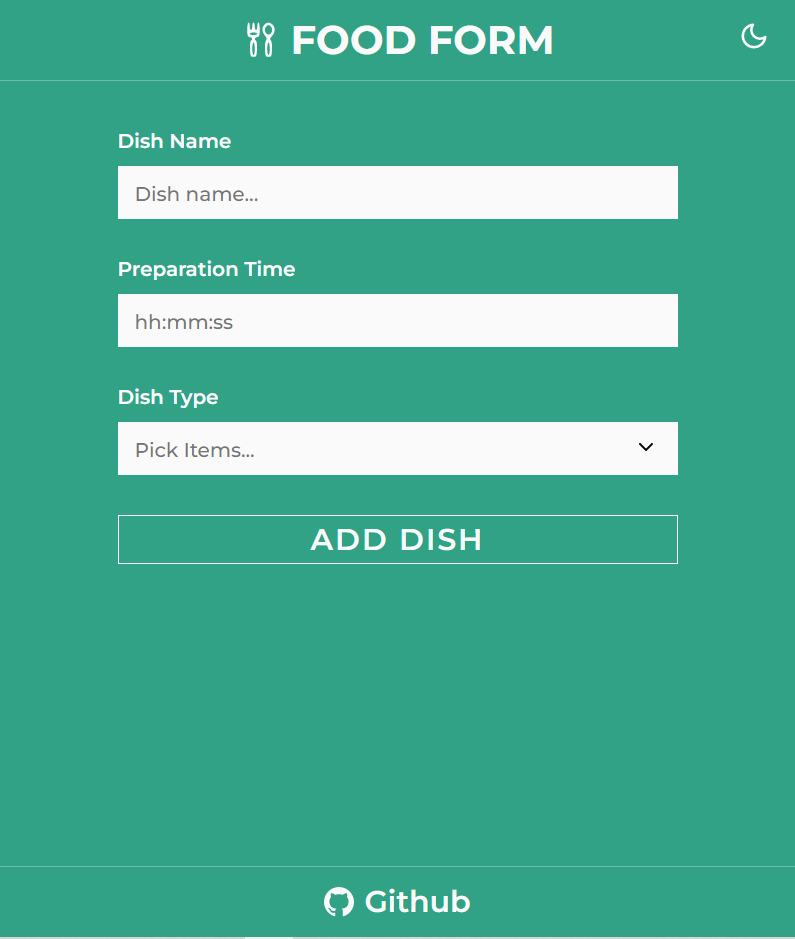
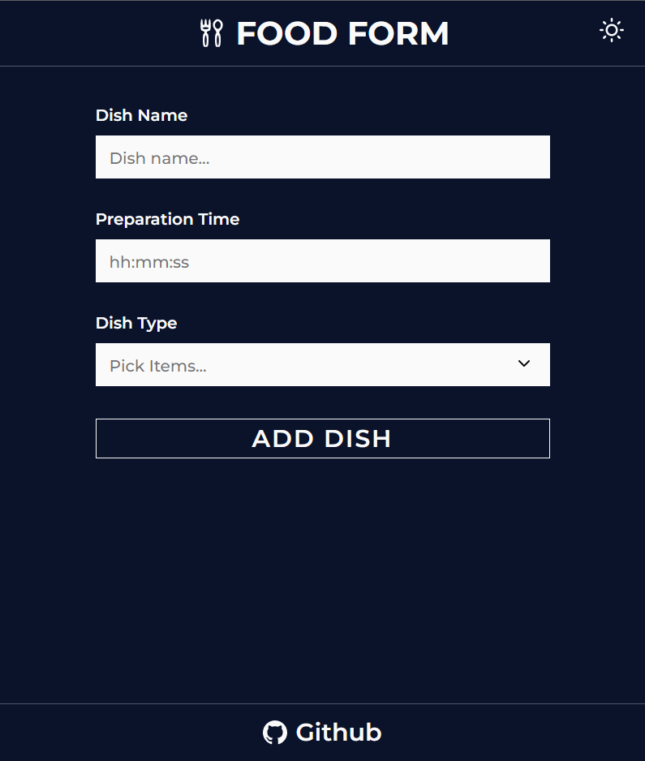
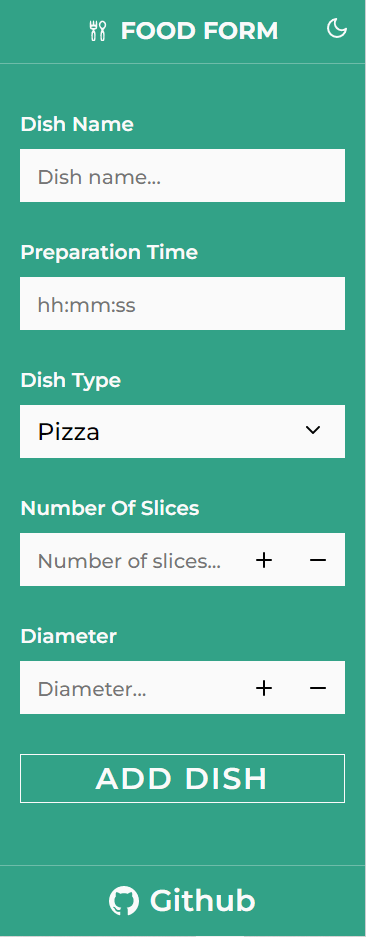
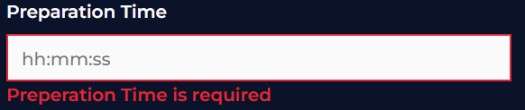
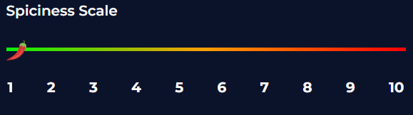
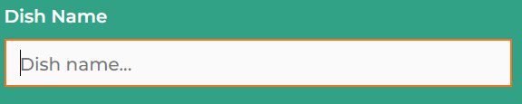
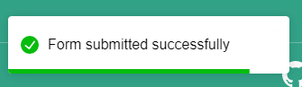
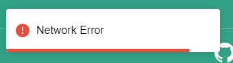

# Food Form

### Live preview:

[https://amargielewski.github.io/food-form/](https://amargielewski.github.io/food-form/)

## Installation

#### Node version: 16.13.2

#### Npm version: 8.1.2

### Setup:

```console
$ yarn install
$ yarn start
```

## Technologies used:

- React,
- Typescript
- Styled Components
- React-hook-form
- Yup
- Axios
- React-Toastify

## Screenshots










